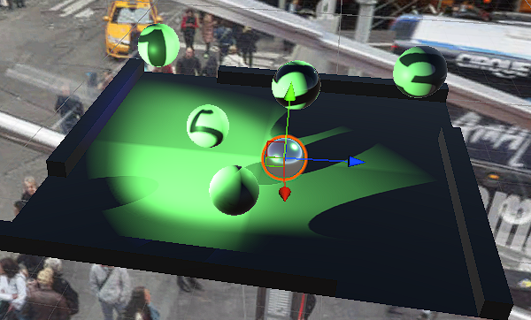
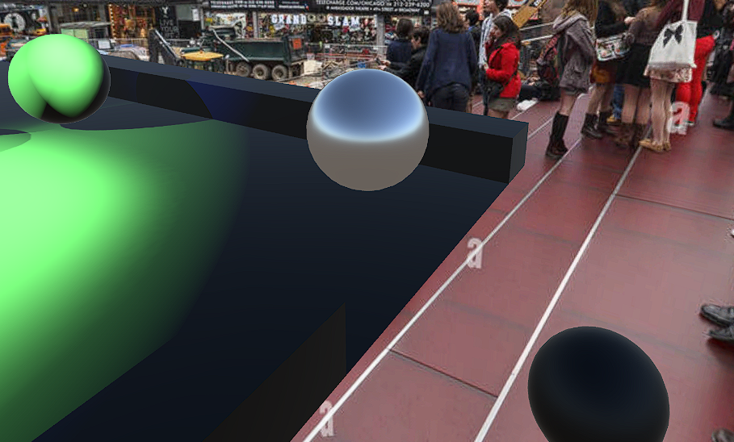

# 3D-Graphics-Programming
Unity

## Project 1 - boulder pushing

### The scene contains a platorm, walls and spheres. One sphere is controlled by the user and our task is to get rid of the other with number textures.

